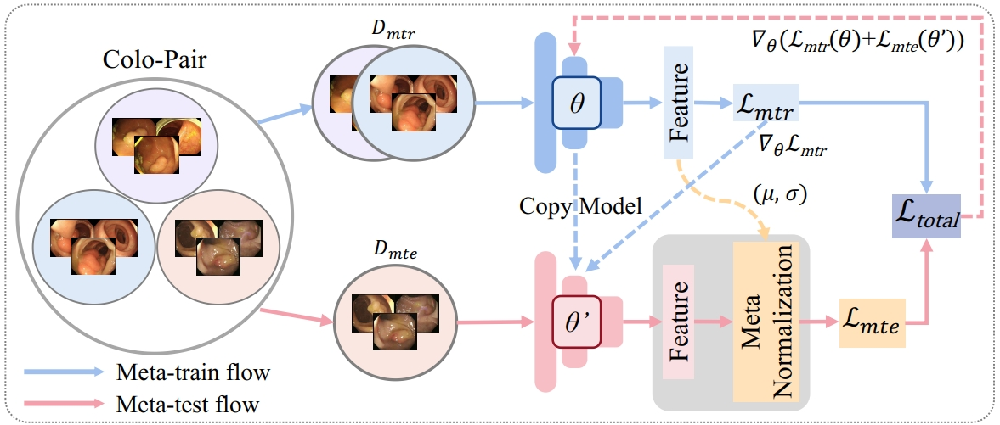

# Colo-ReID: Discriminative Representation Embedding with Meta-learning for Colonoscopic Polyp Re-Identification

## Introduction

we propose a simple but effective training method named Colo-ReID, which can help our model learn more general and discriminative knowledge based on the meta-learning strategy in scenarios with fewer samples. Based on this, a dynamic Meta-Learning Regulation mechanism called MLR is introduced to further boost the performance of polyp re-identification. Our experimental results show that Colo-ReID consistently outperforms second-best method in terms of mAP performance by +2.3% on polyp re-identification task.




## Installation

TorchMultimodal requires Python >= 3.7. The library can be installed with or without CUDA support.
The following assumes conda is installed.

## Contributing
See the [CONTRIBUTING](CONTRIBUTING.md) file for how to help out.

## License

TorchMultimodal is BSD licensed, as found in the [LICENSE](LICENSE) file.

## Acknowledgments
This work was supported by the National Natural Science Foundation of China under Projects (Grant No. 62301315).
If you have further questions and suggestions, please feel free to contact us (xiangsuncheng17@sjtu.edu.cn).

If you find this code useful in your research, please consider citing:
```
@inproceedings{xiang2024vt,
  title={VT-ReID: Learning Discriminative Visual-Text Representation for Polyp Re-Identification},
  author={Xiang, Suncheng and Liu, Cang and Ruan, Jiacheng and Cai, Shilun and Du, Sijia and Qian, Dahong},
  booktitle={ICASSP 2024-2024 IEEE International Conference on Acoustics, Speech and Signal Processing (ICASSP)},
  pages={3170--3174},
  year={2024},
  organization={IEEE}
}

@article{xiang2023towards,
  title={Towards Discriminative Representation with Meta-learning for Colonoscopic Polyp Re-Identification},
  author={Xiang, Suncheng and Chen, Qingzhong and Cai, Shilun and Zhou, Chengfeng and Cai, Crystal and Du, Sijia and Qian, Dahong},
  journal={arXiv preprint arXiv:2308.00929},
  year={2023}
}
```
